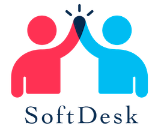

## Table of Contents
1. [General Info](#general-info)
2. [Technologies](#technologies)
3. [Installation](#installation)

### General Info
***
SoftDesk, une société d'édition de logiciels de développement et de collaboration, a décidé de publier une application permettant de remonter et suivre des problèmes techniques (issue tracking system). Cette solution s’adresse à des entreprises clientes, en B2B. 

### Logo

## Technologies
***
A list of technologies used within the project:
* [Python3](https://example.com): Version 3.9.7 
* CF requirements.txt
## Installation
***
A little intro about the installation. 
```
$ python3 venv env
$ source env/bin/activate
$ git clone https://github.com/arthurmengual/P9.git
$ pip install -r requirements.txt
$ cd softdesk
$ ./manage.py migrate
$ ./manage.py runserver
```
